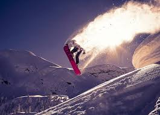
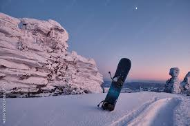

<!DOCTYPE html>
<html lang="en">
<head>
    <meta charset="UTF-8">
    <meta name="viewport" content="width=device-width, initial-scale=1.0">
    <meta http-equiv="X-UA-Compatible" content="ie=edge">
    <title>New to Snowboarding</title>
    <link rel="stylesheet" href="css/scratch.css">
    

    
</head>
<body>
      
    

    

        <a href="index.html">Link to my Home Page</a> 
        <h1 id="topid">Beginning to Snowboard</h1>
         
        

         
        <a href="#SnowboardingEssentials:">Jump to the Snowboarding Essentials!</a>

    

    

        
        <h3>The History of Snowboarding</h3>
            Snowboarding, a sport that has evolved into a global phenomenon, traces its roots back to the 1960s.  
            It began with Sherman Poppen, an engineer in Muskegon, Michigan, who invented the "snurfer" (a portmanteau of "snow" and "surf") as a winter toy for his daughters in 1965.  
            The snurfer was essentially two skis bolted together, with a rope at the nose for steering, and quickly gained popularity, leading to organized competitions. The 1970s saw further innovation, with individuals  
            like Dimitrije Milovich and Tom Sims contributing to the sport's development. Milovich, inspired by his surfing and skateboarding experiences, created boards that mimicked the feel of  
            surfing on snow, while Sims, a skateboard champion, crafted snowboards from wood and fiberglass. Jake Burton Carpenter, often credited with popularizing the sport, founded Burton Snowboards in 1977, introducing designs that incorporated bindings, allowing for greater control. Throughout the 1980s, snowboarding faced resistance from traditional ski resorts, many of which banned the sport due to concerns over safety and the unconventional image of snowboarders. Despite this, the sport's popularity surged, driven by a growing subculture that embraced the rebellious and free-spirited ethos of snowboarding. By the late 1980s, many resorts began to lift their bans as they recognized the sport's commercial potential. The 1990s marked a period of mainstream acceptance and rapid growth, culminating in snowboarding's inclusion in the Winter Olympics at Nagano in 1998. This milestone not only legitimized the sport but also showcased it to a global audience, cementing its place in the pantheon of winter sports.  
            Over the years, technological advancements in board design and gear, along with the rise of snowboarding icons and the proliferation of snowboarding media, have further propelled the sport's popularity. Today, snowboarding continues to evolve,
            blending elements of surfing, skateboarding, and skiing, and remains a beloved activity for millions around the world, celebrated for its unique culture and dynamic spirit.   

        

          
    

    

        <h3>Why Snowboarding?</h3>
        Snowboarding offers an unparalleled blend of excitement, freedom, and connection with nature that few other sports 
        can match. Imagine carving your way down a pristine, snow-covered mountain, the cold wind whipping past your face 
        as you glide effortlessly across the powder. Each run brings a new challenge, an opportunity to perfect your technique 
        and push your limits. The rush of adrenaline and the sense of accomplishment you feel after nailing a difficult trick 
        or navigating a steep slope are immensely rewarding. Moreover, snowboarding is not just a sport; it’s a lifestyle. 
        It offers a vibrant community of enthusiasts who share a passion for adventure and the outdoors, making every trip to 
        the slopes an opportunity to forge new friendships and create lasting memories.   
        

            <h3>The Benefits of Snowboarding:</h3>
            The benefits of snowboarding extend far beyond the thrill of the ride. Physically, it provides a full-body workout, 
            engaging core muscles for balance and stability, while also strengthening your legs, arms, and back as you navigate 
            the terrain. This intense physical activity helps to improve cardiovascular health, increase flexibility, and boost 
            overall fitness levels. Mentally, snowboarding demands focus and quick decision-making, honing your ability to 
            concentrate and think on your feet. The sheer beauty of the snow-covered mountains and the serenity of being in
             nature can have a profoundly calming effect, reducing stress and promoting mental well-being. Additionally, 
             learning and mastering new skills on the snowboard builds confidence and fosters a sense of resilience and 
             determination that can positively impact other areas of life. Overall, snowboarding is not just a fun and 
             exhilarating sport; it’s a holistic activity that enhances both physical health and mental well-being.
        
   
    

    

    
        <h3>Ready to Shred?</h3>
        Get ready to embark on the adventure of a lifetime as you dive into the exhilarating world of snowboarding! 
        Picture yourself standing at the top of a majestic, snow-draped peak, your board strapped to your feet, ready 
        to carve your way down. The anticipation is electric, your heart pounding with excitement as you take in the
         breathtaking views. As you push off, the rush of wind in your face and the sensation of gliding effortlessly 
         over the snow will ignite a sense of freedom like never before. Each twist and turn, each leap and descent, 
         is a new thrill waiting to be conquered. The camaraderie of fellow snowboarders, the vibrant après-ski scene, 
         and the sheer joy of mastering new tricks and techniques will make every moment on the mountain unforgettable. 
         Your snowboarding journey is not just about the sport; it’s about embracing the spirit of adventure, pushing your 
         boundaries, and creating memories that will last a lifetime. Get ready to ride the slopes, embrace the challenge, 
         and experience the unparalleled excitement that only snowboarding can offer!   

        

        <h4>Quick Tips To Get Started:</h4>
        Imagine capturing the thrill and essence of snowboarding in just a few minutes—this short video is designed to do just 
        that! Whether you're a complete beginner or just looking to brush up on the basics, this video will take you on a visual
         journey through the fundamental techniques of riding a snowboard. With stunning footage of riders carving through 
         powder and executing smooth turns, combined with clear, step-by-step instructions, you'll get an up-close look
         at how to balance, steer, and stop with confidence. Watching this video is like getting a personal lesson from a 
         pro, breaking down each move in an easy-to-follow format. You'll see how to strap in, find your stance, and make 
         your first descent down the slopes. Dive into this visual guide and feel the excitement build as you prepare to hit 
         the snow with newfound knowledge and enthusiasm!   
           
 
        <iframe width="420" height="315"
            src="https://www.youtube.com/embed/SQNc3VBOgEM">
            </iframe>
        

            <h5 id="SnowboardingEssentials:">Snowboarding Essentials:</h5>
          
            <ol>
            
                <li>Gloves</li> 
                <li>Helmet</li>
                <li>Snow pants and jacket</li>
                <li>Ski goggles</li>
                <li>Warm underclothing</li>
                <li>Boots (must be compatible with bindings)</li>
                <li>Snowboard and Bindings:</li>
                <ul>
                    <li>Burton</li>
                    <li>Salomon</li>
                    <li>Never Sumnmer</li>
                </ul>
            
            </ol>
        

         
         
    

    

        <h5>Favorite Resorts:</h5>
        <ul>
            <li>
            <a href="https://www.keystoneresort.com/" target="_blank">Keystone - Colorado</a> </li>
            <li>Park City - Utah</li>
            <li>Brighton - Utah</li>
        </ul>
    

    

    

    
    <a href="#topid">Jump back to the top of the page</a>

</body>

<noscript></noscript><object class='tableauViz'  style='display:none;'><param name='host_url' value='https%3A%2F%2Fpublic.tableau.com%2F' /> <param name='embed_code_version' value='3' /> <param name='site_root' value='' /><param name='name' value='HRAttritionDashboardRWFD_16570446563570&#47;viz' /><param name='tabs' value='no' /><param name='toolbar' value='yes' /><param name='static_image' value='https:&#47;&#47;public.tableau.com&#47;static&#47;images&#47;HR&#47;HRAttritionDashboardRWFD_16570446563570&#47;viz&#47;1.png' /> <param name='animate_transition' value='yes' /><param name='display_static_image' value='yes' /><param name='display_spinner' value='yes' /><param name='display_overlay' value='yes' /><param name='display_count' value='yes' /><param name='language' value='en-US' /></object>
                
</html>
